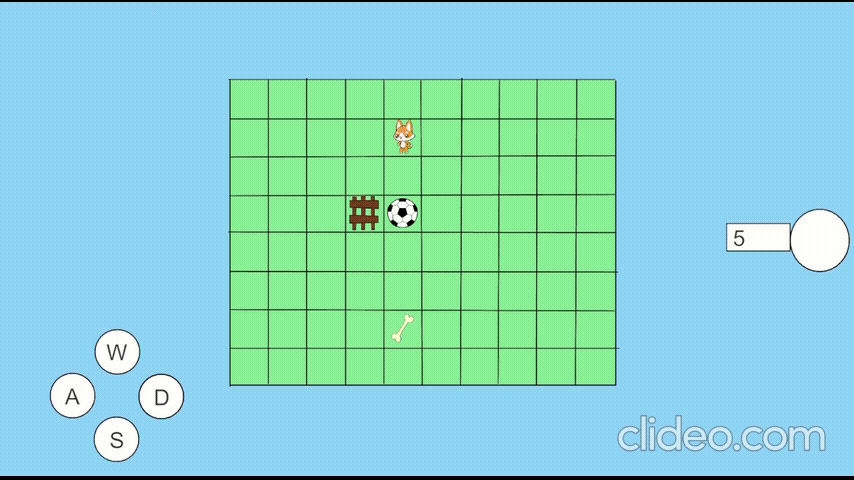

# Grid Puzzle Game 🎮

Un juego de puzzle basado en cuadrícula donde el jugador debe empujar pelotas hacia las metas mientras administra sus movimientos de manera estratégica.

## 🎯 Características Principales

- Sistema de niveles progresivos
- Movimiento basado en cuadrícula
- Mecánicas de empuje de pelotas
- Sistema de pasos limitados por nivel
- Vallas que actúan como obstáculos
- Sistema de metas para completar niveles
- Interfaz de usuario intuitiva
- Sistema de retroceso de movimientos

## 🎲 Cómo Jugar

1. Mueve al jugador usando las teclas de dirección
2. Empuja las pelotas hacia las metas
3. Administra tus pasos sabiamente - ¡cada nivel tiene un límite!
4. Completa el objetivo antes de quedarte sin movimientos
5. Puedes retroceder movimientos si te equivocas

## 🔧 Componentes Principales

### GameManager
- Control principal del juego
- Gestión de niveles
- Validación de movimientos
- Detección de victoria

### PlayerController
- Control del movimiento del jugador
- Interacción con objetos del juego

### BallManager
- Gestión de pelotas en el juego
- Control de movimiento de pelotas
- Detección de colisiones

### GridManager
- Sistema de cuadrícula
- Gestión de posiciones
- Límites del tablero

### MovementsManager
- Registro de movimientos
- Sistema de retroceso
- Validación de movimientos

### GoalManager
- Control de objetivos
- Detección de victoria
- Posicionamiento de metas

### UiManager
- Interfaz de usuario
- Contador de pasos
- Mensajes de victoria

### LevelLoader
- Carga de niveles desde archivos
- Gestión de datos de nivel
- Progresión del juego

## 🎮 Controles

- w Mover arriba
- S Mover abajo
- D Mover derecha
- A Mover izquierda

## 🔄 Sistema de Niveles

Los niveles se cargan desde archivos JSON con la siguiente estructura:
- Posición inicial del jugador
- Posiciones de las pelotas
- Posiciones de las metas
- Posiciones de las vallas
- Número de pasos permitidos

## 🛠️ Requisitos Técnicos

- Unity 2021.3 o superior
- Sistema de Input básico de Unity
- Sistema de UI de Unity

## 📝 Notas de Desarrollo

Para añadir nuevos niveles:
1. Usar JsonCreator para generar la estructura del nivel
2. Colocar el archivo JSON en la carpeta de niveles
3. El juego detectará automáticamente los nuevos niveles

